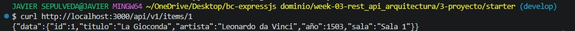
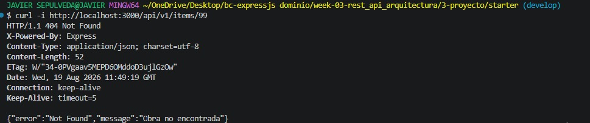
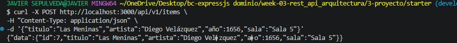
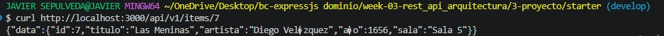
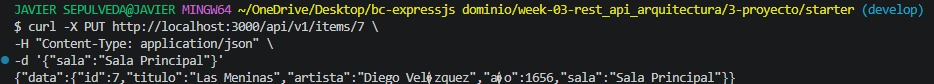
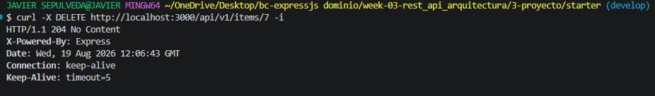
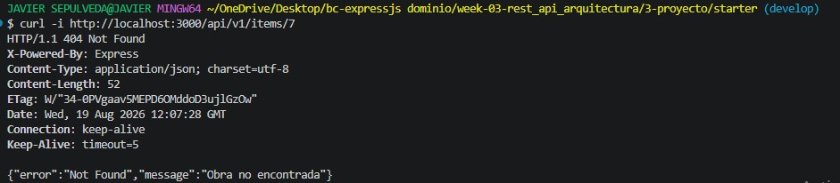

# Proyecto Semana 03 — API REST de Obras de Arte

## Descripción

Este proyecto consiste en una API REST desarrollada con Express y TypeScript para gestionar obras de arte de un museo.

En esta semana se tomó como base el proyecto de la Semana 02 y se organizó utilizando una arquitectura en capas. Esto permite separar las responsabilidades del proyecto y mantener el código más ordenado.

La API utiliza un almacenamiento temporal en memoria y permite realizar operaciones CRUD sobre las obras de arte.

---

## Dominio

**Museo**

### Recurso principal

**Obra de arte**

Cada obra contiene:

* `id`: identificador de la obra.
* `titulo`: título de la obra.
* `artista`: nombre del artista.
* `año`: año de creación.
* `sala`: sala donde se encuentra la obra.

---

## Arquitectura del proyecto

El proyecto está organizado en cuatro capas principales:

```text
Routes
   ↓
Controllers
   ↓
Services
   ↓
Repositories
   ↓
Datos en memoria
```

### Routes
Se encargan de definir las rutas y los métodos HTTP disponibles en la API.

### Controllers
Reciben las peticiones, obtienen los datos necesarios y envían la respuesta al cliente.

### Services
Contienen la lógica de la aplicación, como la paginación y la comunicación con el repository.

### Repositories
Se encargan de manejar los datos almacenados en memoria, incluyendo las operaciones de crear, consultar, actualizar y eliminar.

---

## Tecnologías utilizadas

* Node.js
* Express 5
* TypeScript
* pnpm
* Git
* Git Bash

---

## Endpoints

| Método | Endpoint            | Descripción                        |
| ------ | ------------------- | ---------------------------------- |
| GET    | `/health`           | Comprobar que el servidor funciona |
| GET    | `/api/v1/items`     | Consultar todas las obras          |
| GET    | `/api/v1/items/:id` | Buscar una obra por ID             |
| POST   | `/api/v1/items`     | Crear una nueva obra               |
| PUT    | `/api/v1/items/:id` | Actualizar una obra                |
| DELETE | `/api/v1/items/:id` | Eliminar una obra                  |

---

## Paginación

La API permite consultar las obras utilizando los parámetros `page` y `limit`.

Ejemplo:

```text
GET /api/v1/items?page=1&limit=2
```

La respuesta incluye:

* `data`: obras encontradas.
* `total`: cantidad total de obras.
* `page`: página consultada.
* `limit`: cantidad de elementos por página.

---

## Contratos de respuesta

Las respuestas de la API utilizan una estructura organizada.

Para consultar una obra:

```json
{
  "data": {
    "id": 1,
    "titulo": "La Gioconda",
    "artista": "Leonardo da Vinci",
    "año": 1503,
    "sala": "Sala 1"
  }
}
```

Para consultar varias obras:

```json
{
  "data": [],
  "total": 4,
  "page": 1,
  "limit": 10
}
```

Para una obra que no existe:

```json
{
  "error": "Not Found",
  "message": "Obra no encontrada"
}
```

---

## Pruebas del proyecto

### 1. Comprobar el funcionamiento de la API
En esta prueba comprobé que el servidor estuviera funcionando correctamente mediante el endpoint `/health`.


---

### 2. Consultar todas las obras
En esta prueba consulté todas las obras almacenadas en la API. La respuesta muestra las obras junto con la información de paginación.


---

### 3. Buscar una obra por ID
En esta prueba busqué una obra específica utilizando su número de ID.



---

### 4. Consultar un ID que no existe
En esta prueba utilicé un ID que no estaba registrado para comprobar el manejo del error `404 Not Found`.



---

### 5. Paginación
En esta prueba utilicé los parámetros `page` y `limit` para consultar solamente una cantidad determinada de obras.



---

### 6. Crear una nueva obra
En esta prueba creé una nueva obra de arte enviando sus datos mediante una petición `POST`.



---

### 7. Actualizar una obra
En esta prueba modifiqué la información de una obra que ya estaba registrada utilizando una petición `PUT`.



---

### 8. Eliminar una obra
En esta prueba eliminé una obra utilizando una petición `DELETE`. La API respondió con el código `204 No Content`.



---

### 9. Comprobar la eliminación
Después de eliminar la obra, realicé nuevamente una consulta utilizando su ID. La API respondió con `404 Not Found`, comprobando que la obra había sido eliminada.



---

## Estructura del proyecto

```text
├── 0-assets/
│   ├── 01-layered-architecture.svg
│   ├── 02-rest-contracts.svg
│   ├── 03-dtos-types.svg
│   ├── prueba1.jpeg
│   ├── prueba2.jpeg
│   ├── prueba3.jpeg
│   ├── prueba4.jpeg
│   ├── prueba5.jpeg
│   ├── prueba6.jpeg
│   ├── prueba7.jpeg
│   ├── prueba8.jpeg
│   └── prueba9.jpeg
│
├── src/
│   ├── controllers/
│   │   └── items.controller.ts
│   ├── repositories/
│   │   └── items.repository.ts
│   ├── routes/
│   │   └── items.routes.ts
│   ├── services/
│   │   └── items.service.ts
│   ├── app.ts
│   ├── server.ts
│   └── types.ts
│
├── .env.example
├── .gitignore
├── package.json
├── pnpm-lock.yaml
├── README.md
└── tsconfig.json
```

---

## Resultado

El proyecto permite gestionar obras de arte mediante una API REST organizada en diferentes capas.

Durante el desarrollo se implementaron:

* Arquitectura en capas.
* Rutas REST.
* Controllers delgados.
* Services para la lógica de la aplicación.
* Repository para manejar los datos.
* DTOs utilizando TypeScript.
* Respuestas JSON consistentes.
* Paginación.
* Manejo de errores `404`.
* Operaciones CRUD completas.

Los datos utilizados en el proyecto se almacenan temporalmente en memoria, por lo que no se utiliza una base de datos.

---

## Conclusión

La Semana 03 permitió reorganizar la API de obras de arte realizada anteriormente y separar las responsabilidades de cada parte del proyecto.

Esta estructura facilita entender el funcionamiento de la API, realizar cambios y mantener el código organizado.
