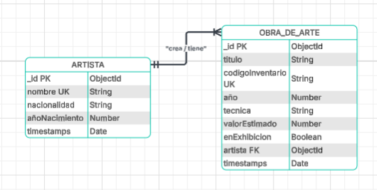
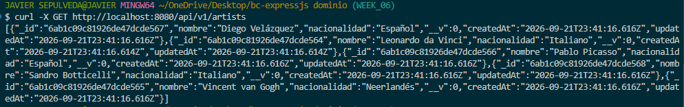
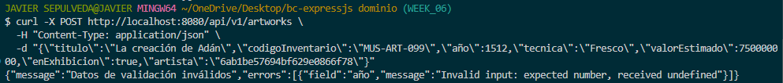
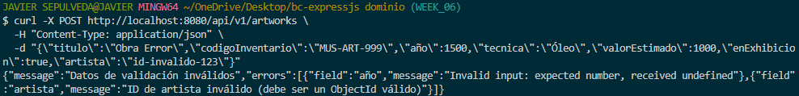

# Proyecto Semana 06 — API REST con MongoDB y Mongoose

## 1. Descripcion del Dominio

API REST para la gestion de un Museo, implementando persistencia en MongoDB mediante Mongoose con relaciones referenciadas (populate), paginacion y validaciones con Zod.

- **Dominio:** Museo
- **Entidad Secundaria:** Artista (`Artist`)
- **Entidad Principal:** Obra de Arte (`Artwork`)
- **Relacion:** Cada obra de arte tiene una referencia `ObjectId` hacia su respectivo artista (`artista: ObjectId ref 'Artist'`).

---

## 2. Diagrama de Entidades



---

## 3. Requisitos Implementados

1. **Modelos Mongoose:**
   - `Artist` (`src/models/secondary.model.ts`): Coleccion `artists` con `nombre` unico.
   - `Artwork` (`src/models/primary.model.ts`): Coleccion `artworks` con campo `artista` referenciando a `Artist`.
2. **Consultas con populate:**
   - Los endpoints `GET /api/v1/artworks` y `GET /api/v1/artworks/:id` devuelven el objeto completo del artista poblado en el campo `artista`.
3. **Paginacion y Filtro:**
   - `GET /api/v1/artworks?page=1&limit=5&search=noche` con respuesta `{ data, total, page, totalPages }`.
4. **Manejo Centralizado de Errores:**
   - Codigo `11000` (campo unico duplicado) -> `409 Conflict`.
   - `CastError` (formato de ObjectId invalido) -> `400 Bad Request`.
   - Registro no encontrado -> `404 Not Found`.
5. **Seed:**
   - Script `src/seed.ts` ejecutable con `pnpm seed` que limpia e inserta 5 artistas y 8 obras de arte.

---

## 4. Instrucciones de Uso

### Paso 1: Levantar MongoDB con Docker
```bash
docker compose up -d
```

### Paso 2: Instalar dependencias
```bash
pnpm install
```

### Paso 3: Configurar variables de entorno
```bash
cp .env.example .env
```

### Paso 4: Cargar datos iniciales (Seed)
```bash
pnpm seed
```

### Paso 5: Iniciar el servidor
```bash
pnpm dev
```
Servidor disponible en: `http://localhost:8080`

---

## 5. Endpoints de la API

### Artistas (`/api/v1/artists`)

| Metodo | Ruta | Descripcion | Status |
| :--- | :--- | :--- | :--- |
| `GET` | `/api/v1/artists` | Listar todos los artistas | 200 |
| `GET` | `/api/v1/artists/:id` | Obtener artista por ID | 200 / 400 / 404 |
| `POST` | `/api/v1/artists` | Crear un artista | 201 / 400 / 409 |
| `PUT` | `/api/v1/artists/:id` | Actualizar un artista | 200 / 400 / 404 |
| `DELETE`| `/api/v1/artists/:id` | Eliminar un artista | 204 / 400 / 404 |

---

### Obras de Arte (`/api/v1/artworks`)

| Metodo | Ruta | Descripcion | Status |
| :--- | :--- | :--- | :--- |
| `GET` | `/health` | Estado del servidor | 200 |
| `GET` | `/api/v1/artworks?page=1&limit=5` | Listar obras (paginado + populate) | 200 |
| `GET` | `/api/v1/artworks/:id` | Detalle de obra con populate | 200 / 400 / 404 |
| `POST` | `/api/v1/artworks` | Crear obra (valida ObjectId de artista) | 201 / 400 / 409 |
| `PUT` | `/api/v1/artworks/:id` | Actualizar obra | 200 / 400 / 404 |
| `DELETE`| `/api/v1/artworks/:id` | Eliminar obra | 204 / 400 / 404 |

---

## 6. Ejemplos de Peticion

### Crear Artista (`POST /api/v1/artists`)
```json
{
  "nombre": "Claude Monet",
  "nacionalidad": "Frances",
  "añoNacimiento": 1840
}
```

### Crear Obra de Arte con referencia (`POST /api/v1/artworks`)
```json
{
  "titulo": "Impresion, sol naciente",
  "codigoInventario": "MUS-ART-020",
  "año": 1872,
  "tecnica": "Oleo sobre lienzo",
  "valorEstimado": 150000000,
  "enExhibicion": true,
  "artista": "6ab1c09c81926de47dcde567"
}
```

---

## 7. Capturas de Pantalla (Evidencia de Pruebas)

### 1. Listado de Artistas


---

### 2. Creacion de Obra de Arte


---

### 3. Error de Validacion de Artista (400 Bad Request)


---

### 4. Error de Codigo Duplicado (409 Conflict)

