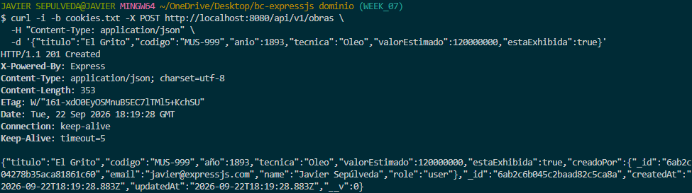
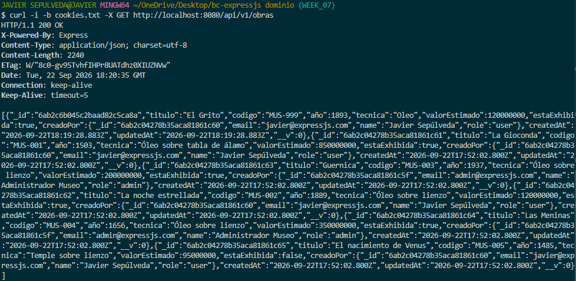
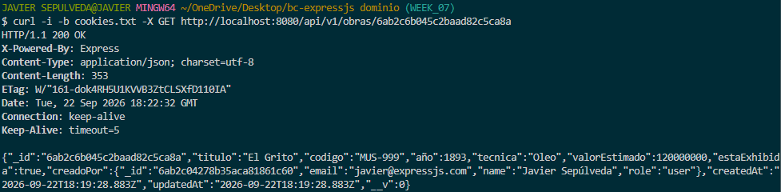
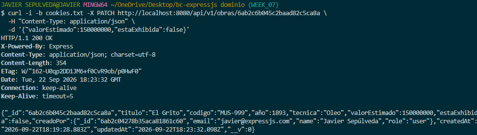
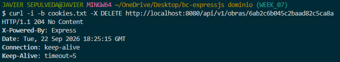
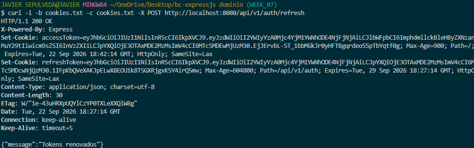
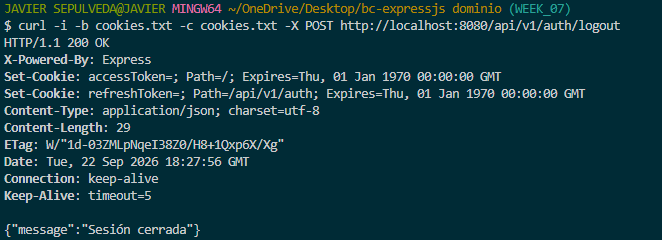
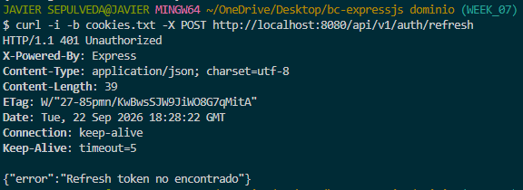

# Proyecto Semana 07 — API Museo con Autenticación JWT

API REST para la administración de un **Museo (Obras de Arte)** con sistema de usuarios, autenticación segura mediante **JWT** y almacenamiento en cookies **HttpOnly**.

---

## 🏛️ 1. Dominio y Recurso Principal

* **Dominio:** Museo
* **Recurso Principal:** `Obras de Arte`
* **Recurso de Usuarios:** `User` (Curador / Administrador)
* **Base de Datos:** MongoDB con Mongoose

### Campos de una Obra de Arte:
* `titulo`: Nombre de la obra.
* `codigo`: Código de inventario único (ej: `MUS-001`).
* `año`: Año de creación.
* `tecnica`: Material o técnica (ej: `Óleo sobre lienzo`).
* `valorEstimado`: Precio estimado en el catálogo.
* `estaExhibida`: Si está en exhibición o en depósito (`true` / `false`).
* `creadoPor`: Usuario/Curador que registró la obra.

---

## 🚀 2. Cómo Ejecutar el Proyecto

### Paso 1: Iniciar MongoDB en Docker
```bash
docker compose up -d
```

### Paso 2: Instalar dependencias
```bash
pnpm install
```

### Paso 3: Cargar datos de prueba (Seed)
```bash
pnpm seed
```

### Paso 4: Iniciar el servidor
```bash
pnpm dev
```
El servidor estará listo en: `http://localhost:8080`

---

## 📌 3. Endpoints de la API

### Autenticación (`/api/v1/auth`)
* `POST /api/v1/auth/register` — Registro de nuevo usuario.
* `POST /api/v1/auth/login` — Iniciar sesión (guarda cookies de acceso).
* `POST /api/v1/auth/refresh` — Renovar sesión con nuevo token.
* `GET /api/v1/auth/me` — Ver perfil del usuario conectado (Ruta protegida).
* `POST /api/v1/auth/logout` — Cerrar sesión y limpiar cookies.

### Obras de Arte (`/api/v1/obras` - Rutas Protegidas)
* `GET /api/v1/obras` — Listar todas las obras registradas.
* `GET /api/v1/obras/:id` — Consultar detalle de una obra por su ID.
* `POST /api/v1/obras` — Registrar una nueva obra de arte.
* `PATCH /api/v1/obras/:id` — Actualizar los datos de una obra.
* `DELETE /api/v1/obras/:id` — Eliminar una obra del inventario.

---

## 📸 4. Evidencias de Pruebas (Screenshots)

### 1. Registro Exitoso (`POST /api/v1/auth/register` → 201 Created)


---

### 2. Login con Cookies en la Respuesta (`POST /api/v1/auth/login` → 200 OK)


---

### 3. CRUD Completo del Recurso (5 Operaciones)

#### 3.1. Crear Obra (`POST /api/v1/obras` → 201 Created)


#### 3.2. Listar Obras (`GET /api/v1/obras` → 200 OK)


#### 3.3. Detalle de Obra por ID (`GET /api/v1/obras/:id` → 200 OK)


#### 3.4. Actualizar Obra (`PATCH /api/v1/obras/:id` → 200 OK)


#### 3.5. Eliminar Obra (`DELETE /api/v1/obras/:id` → 204 No Content)


---

### 4. Acceso Protegido Sin Token (`GET /api/v1/obras` → 401 Unauthorized)


---

### 5. Refresh Token Exitoso con Rotación (`POST /api/v1/auth/refresh` → 200 OK)


---

### 6. Logout y Refresh Posterior (`POST /api/v1/auth/refresh` → 401 Unauthorized)

#### 6.1. Cierre de Sesión (Logout → 200 OK)


#### 6.2. Intento de Refresh tras Logout (Bloqueado → 401 Unauthorized)

