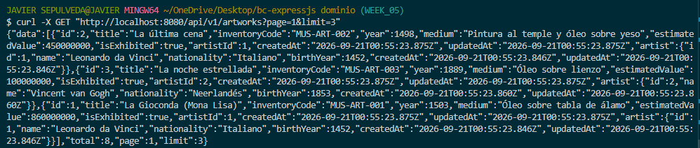
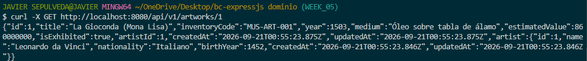
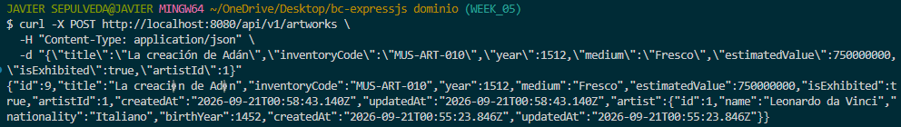
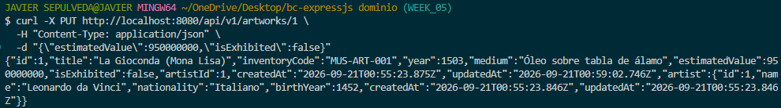
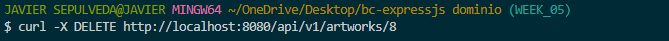

# Proyecto Semana 05 — API con PostgreSQL y Prisma ORM

## 1. Descripción y Dominio

API REST desarrollada para la gestión de un **Museo**, implementando persistencia en **PostgreSQL** mediante **Prisma ORM**.

- **Dominio:** Museo
- **Recurso principal:** `Artwork` (Obra de Arte)
- **Recurso secundario:** `Artist` (Artista)
- **Relación:** 1 Artista puede tener muchas Obras de Arte (1:N).

---

## 2. Diagrama de Entidades

```text
[ Artist ] 1 ────────── N [ Artwork ]
- id (PK)                 - id (PK)
- name                    - title
- nationality             - inventoryCode (UK)
- birthYear               - year
                          - medium
                          - estimatedValue
                          - isExhibited
                          - artistId (FK)
```

---

## 3. Requisitos Implementados

1. **Modelos y Migraciones:** Modelos `Artist` y `Artwork` en `prisma/schema.prisma` con tipos de datos, timestamps y código de inventario único (`@unique`).
2. **Seed Idempotente:** Script en `prisma/seed.ts` que limpia datos previos (`deleteMany`) y carga 5 artistas y 8 obras de arte.
3. **Control de Errores de Base de Datos:**
   - `P2002` (código único duplicado) -> `409 Conflict`
   - `P2025` (registro no encontrado) -> `404 Not Found`
   - `P2003` (clave foránea no existe) -> `404 Not Found`
4. **Paginación:** Endpoint de listado con parámetros `page` y `limit`, retornando `{ data, total, page, limit }`.
5. **Validación:** Esquemas Zod para la creación y actualización de obras.

---

## 4. Instrucciones de Uso

### Paso 1: Levantar PostgreSQL con Docker
```bash
docker compose up -d
```

### Paso 2: Instalar dependencias
```bash
pnpm install
```

### Paso 3: Configurar variables de entorno
```bash
cp .env.example .env
```

### Paso 4: Ejecutar migraciones
```bash
pnpm dlx prisma migrate dev --name init
```

### Paso 5: Poblar la base de datos (Seed)
```bash
pnpm dlx prisma db seed
```

### Paso 6: Iniciar el servidor
```bash
pnpm dev
```
Servidor disponible en: `http://localhost:8080`

---

## 5. Logs del Seed

Resultado de la ejecución de `pnpm dlx prisma db seed`:

```plaintext
> tsx prisma/seed.ts

Iniciando seed para el dominio Museo...
Datos previos eliminados.
5 artistas creados.
8 obras de arte creadas exitosamente.
```

---

## 6. Endpoints de la API

Ruta base: `http://localhost:8080/api/v1/artworks`

| Método | Ruta | Descripción | Status |
| :--- | :--- | :--- | :--- |
| `GET` | `/health` | Estado del servidor | 200 |
| `GET` | `/api/v1/artworks?page=1&limit=10` | Listado paginado con datos del artista | 200 |
| `GET` | `/api/v1/artworks/:id` | Detalle de una obra por ID | 200 / 404 |
| `POST` | `/api/v1/artworks` | Crear nueva obra | 201 / 400 / 409 |
| `PUT` | `/api/v1/artworks/:id` | Actualizar obra existente | 200 / 400 / 404 |
| `DELETE`| `/api/v1/artworks/:id` | Eliminar obra por ID | 204 / 404 |

### Ejemplos de Petición

#### Crear obra (`POST /api/v1/artworks`)
```json
{
  "title": "La noche estrellada",
  "inventoryCode": "MUS-ART-003",
  "year": 1889,
  "medium": "Óleo sobre lienzo",
  "estimatedValue": 100000000,
  "isExhibited": true,
  "artistId": 2
}
```

#### Actualizar obra (`PUT /api/v1/artworks/1`)
```json
{
  "estimatedValue": 950000000,
  "isExhibited": false
}
```

---

## 7. Capturas de Pantalla (Postman / Thunder Client)

### 1. GET — Listado Paginado (`/api/v1/artworks`)


---

### 2. GET — Detalle por ID (`/api/v1/artworks/:id`)


---

### 3. POST — Crear Obra (`/api/v1/artworks`)


---

### 4. PUT — Actualizar Obra (`/api/v1/artworks/:id`)


---

### 5. DELETE — Eliminar Obra (`/api/v1/artworks/:id`)

