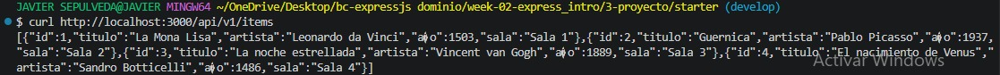
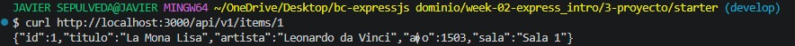
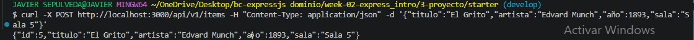
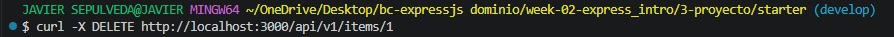

# Proyecto Semana 02 — API REST de Obras de Arte

## Descripción

Este proyecto consiste en una API REST desarrollada con Express y TypeScript para gestionar obras de arte de un museo.

La API permite realizar operaciones CRUD sobre las obras de arte, utilizando un almacenamiento temporal en memoria.

## Dominio

**Museo**

### Recurso principal

**Obra de arte**

Cada obra contiene:

- `id`: identificador de la obra.
- `titulo`: título de la obra.
- `artista`: nombre del artista.
- `año`: año de creación.
- `sala`: sala donde se encuentra la obra.

## Tecnologías utilizadas

- Node.js
- Express 5
- TypeScript
- pnpm
- Git
- Git Bash
 
## Pruebas de proyecto

1. Consultar todos los elementos
Con esta prueba pude ver todos los elementos que estaban guardados en la API.


2. Buscar un elemento por ID
En esta prueba busqué un elemento específico usando su número de ID. Esto permite consultar solamente un registro.


3. Crear un nuevo elemento
Aquí probé la creación de un nuevo elemento. Se enviaron los datos y la API respondió mostrando el elemento creado.


4. Actualizar un elemento
En esta prueba modifiqué la información de un elemento que ya estaba registrado. Después de hacer el cambio, se mostró la información actualizada.


5. Eliminar un elemento
Finalmente probé la opción de eliminar un elemento. La prueba permitió comprobar que el registro podía ser eliminado correctamente.


## Estructura del proyecto

```text
week-02-express_intro/
│
├── 0-assets/
│   ├── 01-express-vs-http.svg
│   ├── 02-middleware-chain.svg
│   ├── 03-http-methods-codes.svg
│   ├── prueba1.jpeg
│   ├── prueba2.jpeg
│   ├── prueba3.jpeg
│   ├── prueba4.jpeg
│   └── prueba5.jpeg
│
├── 1-teoria/
│   ├── 02-routing.md
│   ├── 03-middleware.md
│   └── 04-req-res-lifecycle.md
│
├── 2-practicas/
│   ├── ejercicio-01-hello-express/
│   └── ejercicio-02-middleware/
│
├── 3-proyecto_starter/
│   ├── node_modules/
│   ├── src/
│   │   ├── routes/
│   │   ├── app.ts
│   │   ├── server.ts
│   │   ├── store.ts
│   │   └── types.ts
│   │
│   ├── .env.example
│   ├── package.json
│   ├── pnpm-lock.yaml
│   └── tsconfig.json
│
├── 5-glosario/
│   └── README.md
│
└── README.md